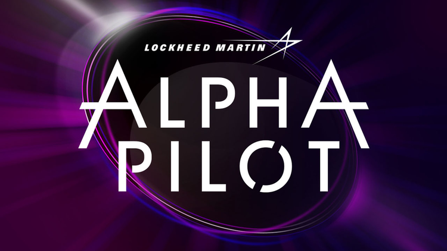
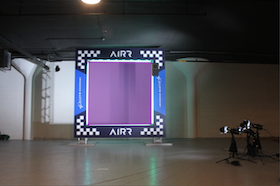
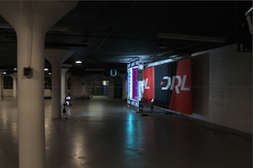
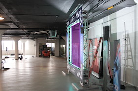

#### Introduction
This represents the work I did for the [AlphaPilot Challenge](https://www.herox.com/alphapilot), an AI drone racing challenge.  This part of the challenge was a computer vision problem where we were given many images of gates that the drone would need to learn to safely navigate through.  The goal was to identify the four coordinates that describe the inner polygon of the gate.  Similar to a traditional object detection problem but requiring predicting a polygon instead of a rectangle.

The model achieved a mAP of 86.43% on the test set.  For an in depth explanation of the methodology used please see the [Technical Report](TechnicalReport.pdf).

#### Sample predictions

#### Dependencies
- python 3.6+
- torch
- torchvision
- fastai
- Shapely
- jupyter

#### Notebooks
- `train_v20run1.ipynb`: Train the model.
- `ap2vott.ipynb`: Convert from AlphaPilot to Microsoft VoTT format for easy visualization.
- `vott2ap.ipynb`: Convert from Microsoft VoTT to AlphaPilot format for importing hand labeled data.
- `fix_bad_labels.ipynb`: Automatically identify and fix labels with incorrect ordering of points.
- `visualize_bounding_boxes.ipynb`: Show images with bounding boxes.
- `geometry.ipynb`: Playing around with using geometric transformations to enhance predictions.

#### Directories
- `submission`: Inference code to score the model.  Note: model not included.
- `labels`: Ground truth labels.
- `results`: Results from various stages of training.
